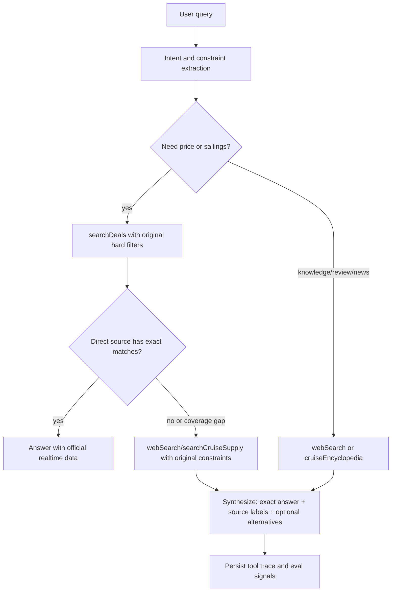

# 游速达自然 Agent 改造技术方案

> 版本：2026-05-08  
> 目标：让 agent 先回答用户真正问的问题，把直连价格源、网络搜索、专业百科都当作工具，而不是把数据库覆盖范围当作事实边界。

## 0. 落地状态（2026-05-08）

当前已完成第一轮最小可用改造，并已部署到生产环境：

- `229c201 Improve natural agent source boundaries`
  - 完成 prompt 行为契约、`searchDeals` 覆盖语义、`webSearch` 航线供给 schema 与来源标准化。
- `df52072 Add intent-aware tool routing`
  - 新增轻量意图识别与 `prepareStep.activeTools` 工具集合控制。
- `42d29f4 Persist agent tool traces`
  - 新增 `agent_runs` / `agent_steps`，持久化工具调用 trace 摘要。

生产验证：

- 远端 `/srv/cruise_agent` 构建通过。
- PM2 应用 `cruise_agent` 已重启并在线。
- `http://127.0.0.1:3000/chat` 健康检查返回 `200`。
- 远端 `agent.db` 已创建 `agent_runs` 与 `agent_steps` 表。

## 1. 背景与问题

当前 agent 已经有 `searchDeals`、`webSearch`、`cruiseEncyclopedia` 等工具，也已经在 prompt 中写了“直连价格源 0 条时再搜索”。但实际体验仍可能出现类似问题：

用户问“天津港有没有船”，直连价格源没有天津港报价时，agent 倾向于推荐数据库里存在的“上海出发”航线。这个回答从销售视角看不自然，因为用户问的是天津港，不是“给我随便找个中国母港”。

根因不是某一个港口别名缺失，而是 agent 的语义边界设计不清：

- 用户约束没有被当作硬约束。`天津港`、`往返`、`指定品牌`、`日期`等条件一旦查不到，模型容易把“相近可售结果”当成答案。
- 数据源覆盖和市场事实混在一起。`searchDeals` 返回 0 只能说明“直连价格源暂未收录”，不能说明“市场没有船”。
- web search 目前是兜底工具，但缺少“航线供给/官方班期/港口市场信息”这类专用搜索语义。
- 现有 prompt 对工具有很多强约束，但缺少可测试的回答契约，例如“放宽条件后的推荐必须单独标注为备选”。
- 缺少 agent run 级别的可观测性，难以判断一次回答是没调 web search、web search 失败，还是调了但结果弱。

## 2. 现有实现观察

相关文件：

- `lib/ai/prompt-template.ts`：默认系统 prompt 已包含“直连价格源无结果时用 webSearch 补充”的规则。
- `lib/ai/tools/search-deals.ts`：`searchDeals` 返回 `count` 和 `deals`，但没有返回覆盖范围、0 结果原因、是否放宽过条件等结构化信息。
- `lib/db/queries.ts`：`searchDeals()` 会按 `departurePort`、`arrivalPort`、`itineraryIncludes` 等条件做硬筛，0 条结果是合理行为。
- `lib/ai/tools/web-search.ts`：当前 `focusDomain` 只有 `general/review/travel/news`，没有面向“官方航线供给/母港班期/港口覆盖”的搜索模式。
- `lib/ai/agent.ts`：使用 `ToolLoopAgent`，目前主要靠 prompt 和工具描述让模型自行路由；没有使用 `prepareStep`、`activeTools` 或持久化 step trace。

结论：第一阶段不需要推翻架构，但需要把“自然问答契约”写进 prompt、工具 schema、工具返回结构和测试集中，而不是只靠一段兜底描述。

### 2.1 最新实现观察

截至 2026-05-08，现有实现已经从“纯 prompt 约束”推进到“prompt + 工具 schema + 运行时路由 + trace”：

- `lib/ai/prompt-template.ts`：已加入“用户约束与数据源边界”和 3 个关键 few-shot 示例。
- `lib/ai/tools/search-deals.ts`：已返回 `appliedFilters`、`exactMatch`、`coverageStatus`、`noResultReason`、`coverageNotes`。
- `lib/db/queries.ts`：已新增 `analyzeSearchCoverage(filters)`，对品牌、出发港、日期等覆盖缺口做轻量分析。
- `lib/ai/tools/web-search.ts`：已增强 `purpose/sourcePreference/mustIncludeTerms/preferredDomains/recency`，并返回标准化 `sources`。
- `lib/ai/intent.ts`：已新增轻量意图和硬约束识别。
- `lib/ai/agent.ts`：已通过 `prepareStep.activeTools` 控制不同意图下可用工具集合。
- `lib/db/agent-db.ts` 与 `lib/db/agent-trace-store.ts`：已新增 agent run/step trace 持久化。
- `app/admin/agent-traces` 与 `app/api/admin/agent-traces`：已新增 trace 查询与 CSV 导出入口，支持按 query、intent、tool 筛选。
- `lib/ai/tools/cruise-encyclopedia.ts`：已修复 `_topic` 未使用问题，并让 topic 参与专业站点搜索词增强。
- `natural-agent-smoke-cases.md` 与 `scripts/evaluate-natural-agent-traces.mjs`：已沉淀 12 条 smoke cases，并提供基于真实 trace 的离线回归检查。

## 3. 外部最佳实践要点

OpenAI 的 agent 指南把 agent 拆成三个核心组件：模型、工具、指令；工具需要标准化、文档化、可复用，指令要明确动作和边界，并覆盖边缘情况。OpenAI 也建议先最大化单 agent 能力，只有在工具相似/重叠导致选择错误时再拆分多 agent。参考：[A practical guide to building agents](https://cdn.openai.com/business-guides-and-resources/a-practical-guide-to-building-agents.pdf)。

OpenAI function calling 文档强调：工具调用是让模型访问训练数据之外的数据和功能；函数定义里的 `description` 应说明工具用途、参数和输出语义；生产环境建议使用严格 schema。参考：[OpenAI Function calling](https://developers.openai.com/api/docs/guides/function-calling)。

OpenAI web search 文档强调：web search 是可选工具，Responses API 中模型可根据输入决定是否搜索；搜索结果需要可见、可点击的引用；可用 domain filtering 和 sources 管理检索范围与来源。参考：[OpenAI Web search](https://developers.openai.com/api/docs/guides/tools-web-search)。

Anthropic 的 agent 文章建议从简单、可组合的模式开始；Routing 适合把不同类别问题分给不同工具/流程；Evaluator-optimizer 适合有明确评价标准、需要迭代提升的输出。参考：[Building effective agents](https://www.anthropic.com/engineering/building-effective-agents)。

Claude prompting 文档提醒：工具使用要给明确方向，但不要用过度激进的“必须/严禁”式提示导致过触发；更好的方式是“在能提升理解时使用工具”。同时，web search 需要 max uses、domain filtering 和 citations。参考：[Claude prompting best practices](https://platform.claude.com/docs/en/build-with-claude/prompt-engineering/claude-prompting-best-practices) 与 [Claude web search tool](https://platform.claude.com/docs/en/agents-and-tools/tool-use/web-search-tool)。

AI SDK 的 `ToolLoopAgent` 支持多步工具循环，并提供 `stopWhen`、`prepareStep`、`activeTools`、step 回调等控制点。当前项目已经使用 `ToolLoopAgent`，可以继续沿用，但需要更明确地控制工具集合、停止条件和观测日志。参考：[AI SDK ToolLoopAgent](https://ai-sdk.dev/docs/reference/ai-sdk-core/tool-loop-agent) 与 [AI SDK Loop Control](https://ai-sdk.dev/docs/agents/loop-control)。

Tavily 作为当前项目的搜索供应商，官方文档建议显式控制 `max_results`、`include_answer`、`include_raw_content` 等影响响应大小和延迟的参数，并通过 `include_domains` / `exclude_domains` 收敛来源范围。参考：[Tavily Search API](https://docs.tavily.com/documentation/api-reference/endpoint/search) 与 [Tavily Search Best Practices](https://docs.tavily.com/documentation/best-practices/best-practices-search)。

## 4. 设计原则

1. 用户约束优先。港口、品牌、日期、往返、经停等明确条件默认都是硬约束，除非用户主动说“附近也行”“帮我推荐替代”。

2. 数据源不是世界边界。直连价格源 0 条只代表当前接入源暂无可报价记录，不能推出市场事实。

3. 不隐式替换。不能把“上海出发”包装成“天津港问题”的答案。替代结果必须放在“如果愿意放宽条件”的单独段落。

4. 来源分层。价格报价优先直连价格源；市场供给、班期和官方入口优先官网/港口/船司/OTA 公开信息；评测和攻略再用专业站或通用网页。

5. 回答先对齐问题，再补选择。先回答“天津港目前查到什么/没查到什么”，再说“可选替代方案”。

6. 可测试。每条关键规则都要对应至少一个 regression case，避免 prompt 改动只凭体感。

## 5. 目标架构

建议采用三段式流程，不一定拆成多 agent，第一版可以在单 `ToolLoopAgent` 内完成。



关键点：

- `searchDeals` 必须先按用户原始硬约束查询。
- 如果 0 条，不做自动放宽；先进入“覆盖缺口处理”。
- web search 的查询也必须保留原始约束，例如“天津港 邮轮 航线 2026 官方”“Tianjin cruise departures 2026 official”。
- 只有合成答案阶段才允许展示上海/香港等替代，但必须写成“若客户能接受放宽到其他中国母港”。

## 6. Prompt 改造方案

### 6.1 新增核心行为契约

建议在 `DEFAULT_SYSTEM_PROMPT_TEMPLATE` 的“核心查询原则”前加入更短、更强的产品语义：

```text
## 用户约束与数据源边界

- 先回答用户原问题，不要把数据库中有的相近结果替换成答案。
- 港口、品牌、日期、往返、经停、预算等用户明确说出的条件默认是硬约束。
- 直连价格源返回 0 条时，只能说明“已接入价格源暂未收录符合条件的报价/航次”，不能说明市场没有。
- 如果原条件查不到，下一步是查公开网络/官方入口来补充市场信息，而不是直接推荐别的港口。
- 只有用户要求推荐备选，或你已经明确说明原条件无精确结果后，才可以给放宽条件后的备选；备选必须单独标注。
```

### 6.2 减少过度强制语言

当前 prompt 中有较多“必须”“严禁”。对于安全性和价格可信度可以保留，但对工具路由更建议用正向、条件化表达：

- 保留：“不要把网络价格说成官网实时数据。”
- 改写：“价格报价优先用直连价格源；当用户问的是市场供给或直连源覆盖不足时，用 webSearch 查公开信息。”
- 避免：“价格问题必须只能用 searchDeals。”这会让“天津港有没有船”这类供给问题被错误压成 DB 价格问题。

### 6.3 增加 few-shot 示例

在 prompt 末尾加入 3 到 5 个短示例，比抽象规则更稳：

```text
示例：用户问“天津港暑假有船吗？”
正确：先查天津港；直连源无结果时，说明“已接入价格源暂未收录天津港暑假报价”，再用 webSearch 查天津港/船司/港口公开信息；如果给上海航线，必须放到“可放宽备选”段落。
错误：直接推荐上海出发，因为上海有数据。
```

## 7. 工具与 Schema 改造

### 7.1 `searchDeals` 返回覆盖语义

当前返回：

```ts
{
  count: result.totalMatches,
  groupedBySailing: true,
  deals: [...]
}
```

建议扩展为：

```ts
{
  count: number,
  groupedBySailing: boolean,
  appliedFilters: {
    brand?: string,
    destination?: string,
    departurePort?: string,
    arrivalPort?: string,
    itineraryIncludes?: string[],
    sailDateFrom?: string,
    sailDateTo?: string
  },
  exactMatch: boolean,
  coverageStatus: "exact_matches" | "no_exact_match" | "source_gap_possible",
  noResultReason?: "no_matching_sailing" | "port_not_covered" | "brand_not_covered" | "date_not_covered" | "unknown",
  deals: [...]
}
```

这样模型可以区分：

- 天津港查不到，因为直连源完全没有天津港。
- 天津港有数据，但日期不匹配。
- 有同品牌但没有该港口。
- 有相近港口，但不是用户要求的港口。

### 7.2 新增 `searchCruiseSupply` 或增强 `webSearch`

当前 `webSearch.focusDomain` 不足以表达“查官方航线供给”。建议二选一：

方案 A：新增专用工具 `searchCruiseSupply`。

```ts
inputSchema: z.object({
  departurePort: z.string().optional(),
  brand: z.string().optional(),
  dateRange: z.string().optional(),
  market: z.enum(["china", "global"]).optional(),
  query: z.string(),
  requireOfficialSources: z.boolean().default(true),
  maxResults: z.number().min(1).max(8).default(5)
})
```

方案 B：增强 `webSearch`。

```ts
purpose: z.enum([
  "official_schedule",
  "market_supply",
  "review",
  "travel",
  "news",
  "general"
])
preferredDomains: z.array(z.string()).optional()
mustIncludeTerms: z.array(z.string()).optional()
recency: z.enum(["any", "month", "year"]).optional()
sourcePreference: z.enum(["official_first", "professional_first", "general"]).optional()
```

推荐先用方案 B，成本低；如果评测显示模型仍混用，再拆出 `searchCruiseSupply`。

### 7.3 web search 来源标准化

工具返回结果建议增加：

```ts
sources: Array<{
  title: string,
  url: string,
  domain: string,
  sourceType: "official_cruise_line" | "official_port" | "ota" | "industry_media" | "review_site" | "general_web",
  publishedDate: string | null,
  snippet: string
}>
```

回答层要求：

- 官网、港口、船司来源可以说“公开信息/官方入口显示”。
- OTA 和行业媒体只能说“网络公开信息参考”。
- 不从网络 snippet 中生成精确报价，除非来源明确且仍标注“网络参考，最终以页面为准”。

## 8. 运行时路由与控制

短期继续使用单 `ToolLoopAgent`，但增加路由辅助。

### 8.1 第一阶段：prompt + tool description

- 改 `DEFAULT_SYSTEM_PROMPT_TEMPLATE`。
- 改 `webSearch.description`，加入“航线供给/官方入口/母港班期”。
- 改 `searchDeals.description`，明确“返回 0 不代表市场没有，只代表直连价格源没有精确匹配”。

### 8.2 第二阶段：轻量 intent classifier

在进入 agent 前，用一个小函数或小模型抽取：

```ts
{
  intent: "price_quote" | "market_supply" | "review" | "comparison" | "copywriting" | "analytics",
  hardConstraints: {
    departurePort?: string,
    brand?: string,
    dateRange?: string,
    roundtrip?: boolean
  },
  allowRelaxation: boolean,
  needsWeb: boolean
}
```

然后把这段结构化 context 注入 `instructions` 或 `experimental_context`，让 agent 更稳定。

### 8.3 第三阶段：`prepareStep` 和 `activeTools`

利用 AI SDK 的 `prepareStep`：

- 第一轮只暴露与 intent 相关的工具，减少工具选择噪音。
- `market_supply` 问题暴露 `searchDeals + webSearch`。
- `review` 问题暴露 `webSearch + cruiseEncyclopedia`。
- `price_quote` 问题先暴露 DB 工具；如果 DB 0 条，再开放 web search。

这比全靠 prompt 更可控，也方便调试。

## 9. 回答格式契约

建议统一为四段，但按问题复杂度可省略：

1. 直接回答用户问的对象。
2. 说明直连价格源结果。
3. 说明网络/官方公开信息结果和引用。
4. 如有必要，给“放宽条件后的备选”。

示例：

```text
按“天津港出发”这个条件看：我直连的价格源暂未收录天津港出发的可报价航次，所以不能把它当成暂无市场供给。

我查到的网络公开信息是：...

如果客户愿意把出发港放宽到上海/香港，已接入价格源里有这些可报价航线：...
```

反例：

```text
天津港没有，推荐你上海出发。
```

这个反例的问题是把“直连源没收录”说成“天津港没有”，并且隐式替换了用户港口。

## 10. 评测用例

至少建立一组固定 smoke/eval cases，每次 prompt 或工具改动后跑：

| 用例 | 期望行为 |
|------|----------|
| 天津港有船吗？ | 先答天津港；DB 0 后 web search；不得直接推荐上海 |
| 天津港暑假最便宜的船 | 区分“直连价格无报价”和“网络班期参考”；不得编价格 |
| 不要上海，只看天津港 | 严格不输出上海备选，除非说明无法查证并请求放宽 |
| 上海也可以，天津优先 | 先天津，后上海备选 |
| 天津港皇家加勒比有吗 | 保留港口和品牌双约束；DB 无结果后搜官方/网络 |
| MSC 中国母港有哪些 | 可查 DB + web；按中国母港市场回答，不局限数据库 |
| 雅典往返，不要开口 | `roundtrip: true`；不能用开口航线替代 |
| 经停圣托里尼 | 用 `itineraryIncludes` 硬筛 |
| 皇家和 MSC 餐饮哪个好 | 使用 web/百科，不走价格工具 |
| 这条 deal 值得买吗 | 价格工具 + 评测/目的地搜索混合 |
| 不要联网，只看你接入的价格源 | 只用 DB，并明确覆盖限制 |
| 帮我查网络上天津港最新邮轮信息 | 必须 web search，给来源 |

评测指标：

- Constraint fidelity：是否保留用户硬约束。
- Source honesty：是否区分直连源和网络信息。
- Search fallback：DB 0 时是否查 web。
- Alternative labeling：备选是否明确标注放宽条件。
- Citation quality：网络信息是否有来源域名/链接。

## 11. 可观测性

建议新增 `agent_runs` / `agent_steps` 或复用后续计划中的 `agent_runs`：

```sql
CREATE TABLE agent_runs (
  id TEXT PRIMARY KEY,
  chat_id TEXT,
  prompt_id TEXT,
  model TEXT,
  user_query TEXT,
  detected_intent TEXT,
  created_at TEXT DEFAULT (datetime('now'))
);

CREATE TABLE agent_steps (
  id INTEGER PRIMARY KEY AUTOINCREMENT,
  run_id TEXT,
  step_number INTEGER,
  tool_name TEXT,
  tool_input_json TEXT,
  tool_output_summary_json TEXT,
  created_at TEXT DEFAULT (datetime('now'))
);
```

重点记录：

- 是否调用了 `searchDeals`。
- `searchDeals.count`。
- 是否调用了 `webSearch`。
- web search 的 query、resultCount、source domains。
- 最终回答是否包含“备选/放宽条件”。

这样遇到“为什么又推荐上海”时，可以直接定位是工具没调、搜索没结果、还是 synthesis 违约。

## 12. 分阶段落地计划

### P0：1 天内

- [x] 改 prompt：加入“用户约束与数据源边界”。
- [x] 改 `webSearch.description`：明确支持港口/母港/航线供给查询。
- [x] 改 `searchDeals.description`：说明 0 条结果语义。
- [x] 加 12 条手工 smoke case 到 `natural-agent-smoke-cases.md`。

验收：天津港问题不会直接跳到上海；如果给上海，必须是放宽条件后的备选。

### P1：2 到 3 天

- [x] 扩展 `searchDeals` 返回 `appliedFilters`、`coverageStatus`、`noResultReason`。
- [x] 增强 `webSearch` schema，增加 `purpose/sourcePreference/mustIncludeTerms`。
- [x] 标准化 web source 输出，包含 `domain/sourceType/publishedDate`。

验收：模型能在回答中说清楚“为什么直连源没有”和“网络来源是什么”。

### P2：3 到 5 天

- [x] 增加 intent extraction。
- [x] 用 `prepareStep` / `activeTools` 控制工具集合。
- [x] 增加 agent run/step trace 持久化。

验收：工具路由可解释，可回放；不同问题类型的误触发明显下降。

### P3：持续优化

- [x] 把 smoke cases 自动化为 trace-based eval。
- 增加 thumbs up/down 和失败原因收集。
- 对常见失败类型做 evaluator-optimizer 式离线评估。
- [x] 增加 trace 查询/导出入口，便于从 UI 或管理端快速定位工具路由问题。
- [x] 修复既有 lint warning：`lib/ai/tools/cruise-encyclopedia.ts` 中 `_topic` 未使用。

验收：prompt/工具改动前后能量化比较，不靠单次聊天体感。

## 13. 代码改动清单

建议优先改这些文件：

- `lib/ai/prompt-template.ts`
  - 加入用户约束、覆盖缺口、备选标注规则。
  - 加入天津港 few-shot 示例。

- `lib/ai/tools/search-deals.ts`
  - 修改工具 description。
  - 扩展返回结构。

- `lib/db/queries.ts`
  - 提供覆盖分析辅助函数，例如 `analyzeSearchCoverage(filters)`。

- `lib/ai/tools/web-search.ts`
  - 扩展 schema。
  - 增加官方/行业/OTA source type 归类。
  - 对 `official_schedule` 和 `market_supply` 构造更合适的 Tavily 参数。

- `lib/ai/agent.ts`
  - 第二阶段加入 `prepareStep` 或 trace 记录。

- `lib/db/agent-db.ts`
  - 第三阶段新增 run/step 表。

## 14. 风险与取舍

- web search 结果质量不稳定：用 domain preference、source type 和引用展示降低风险。
- 网络信息可能过期：回答中必须标注“网络公开信息参考”，最终以船司/OTA 页面为准。
- prompt 过长会降低稳定性：把复杂策略下沉到工具 schema、返回结构和 eval，而不是继续堆 prompt。
- 过早多 agent 化会增加复杂度：先用单 agent + 路由控制，只有工具重叠问题持续存在再拆。
- 价格可信度不能牺牲：精确价格仍以直连价格源为主，网络价格只作为参考并明确标注。

## 15. 最小可用改造后的天津港回答样式

```text
按“天津港出发”这个条件看，我直连的价格源暂未收录天津港出发的可报价航次，所以目前不能给出「官网实时数据」价格。

我继续查了网络公开信息：如果查到天津港/船司/OTA 公开班期，就列出来源和链接；如果没有查到可靠来源，就说明“暂未查到可靠公开班期信息”，而不是说市场没有。

如果客户可以接受放宽到其他中国母港，已接入价格源里可以再看上海/香港等出发港的可报价航线。
```

这就是最终体验目标：用户问什么，先答什么；工具覆盖不到，就诚实说明覆盖缺口；可以推荐备选，但不偷换问题。
